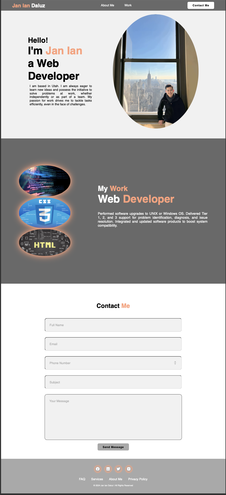

# Jan Ian Daluz - Portfolio

## Description
Welcome to my portfolio! This website showcases my work as a Web Developer, and provides informations about me. Please feel free to explore the different sections to learn more about my background, skills, and projects.

## Table of Contents
About Me
Work
Contact Me

## About Me
In this section, you'll find a brief introduction about me. Learn about my background, interests, and what drives me as a Web Developer.

## Work
Browse through this section to see some of the projects I've worked on. Each project is accompanied by a brief description and a link to the deployed application.

## Contact Me
If you'd like to get in touch, this section provides a contact form where you can reach out to me. Feel free to send me a message, and I'll get back to you as soon as possible.

## Usage
- Clone this repository:
- Navigate to the project directory
- Open the index.html file in your web browser to view the portfolio.

This is the link to the website: 

This is the link to the GitHub repository: 

## Technologies Used
- HTML5
- CSS3
- Boxicons for icons

## Contributing
Contributions are welcome! If you find any issues or have suggestions for improvement, feel free to open an issue or submit a pull request.

## Credits
- Credits given to fellow boot campers, TAs, and instructor.
- Credits given to this youtube video: 
    - [Create Simple Personal Portfolio with HTML and CSS](https://youtu.be/Dtb3DdSvYRY?si=iz5y9y95oyEjQNVg)
- Credits to the following website:
    - [Wikipedia](https://en.wikipedia.org/wiki/Computer_programming)
    - [mdn](https://developer.mozilla.org/en-US/docs/Learn/CSS/First_steps/What_is_CSS)
    - [w3schools](https://www.w3schools.com/html/html_intro.asp)

## License
This project is licensed under the MIT License.

